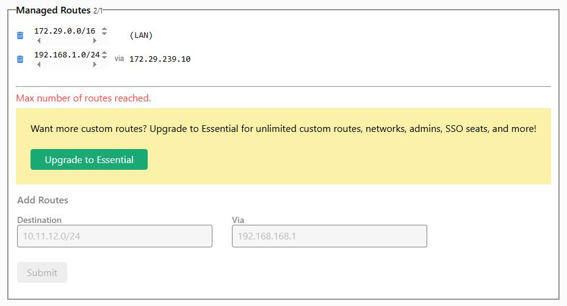

# LanAccessWithZeroTier

## Access your LAN thru mobile phone/computer whatever you are using zero tier sofware defined nework in a LAN host.
```
/usr/bin/ip a
  enp0s3
  192.168.1.17/24
/usr/bin/ip r
  192.168.1.0/24
Create network
  Network ID: abcdefghi12345
/usr/bin/curl -s https://install.zerotier.com | sudo bash
/usr/sbin/zerotier-cli join abcdefghi12345
Authorize
/usr/bin/ip a
  ztnfahsfg3
  172.29.239.10/16
```

```
/usr/bin/nano /etc/sysctl.conf
  net.ipv4.ip_forward=1
/usr/bin/apt-get install iptables
PHY_IFACE=enp0s3; ZT_IFACE=ztnfahsfg3
iptables -t nat -A POSTROUTING -o $PHY_IFACE -j MASQUERADE
iptables -A FORWARD -i $PHY_IFACE -o $ZT_IFACE -m state --state RELATED,ESTABLISHED -j ACCEPT
iptables -A FORWARD -i $ZT_IFACE -o $PHY_IFACE -j ACCEPT
/usr/bin/apt-get update
/usr/bin/apt-get install iptables-persistent
bash -c iptables-save > /etc/iptables/rules.v4
shutdown -r 0

220MB RAM used
0% CPU
```
## Access your LAN thru mobile phone/computer whatever you are using zero tier sofware defined nework in a LAN docker.

## Web interface
```
apt-get update
apt-get install -y python3 python3-venv python3-pip git
mkdir /var/www
cd /var/www
python3 -m venv venv
source venv/bin/activate
pip install Flask gunicorn nginx
git clone https://github.com/urri34/LanAccessWithZeroTier.git
mv LanAccessWithZeroTier/app.py .
mkdir templates
mv LanAccessWithZeroTier/index.html templates/.
##GUNICORN
mv LanAccessWithZeroTier/flaskapp.service /etc/systemd/system/.
systemctl daemon-reexec
systemctl daemon-reload
systemctl enable flaskapp
systemctl start flaskapp
systemctl status flaskapp
## NGINX
mv LanAccessWithZeroTier/LanAccessWithZeroTier /etc/nginx/sites-enabled/.
ln -s /etc/nginx/sites-available/LanAccessWithZeroTier /etc/nginx/sites-enabled/LanAccessWithZeroTier
rm /etc/nginx/sites-enabled/default
nginx -t
systemctl reload nginx
## CONSOLE
mv update-issue-ip.sh /usr/local/bin/.
chmod +x /usr/local/bin/update-issue-ip.sh
systemctl daemon-reload
systemctl enable update-issue
systemctl start update-issue
systemctl status update-issue
````
